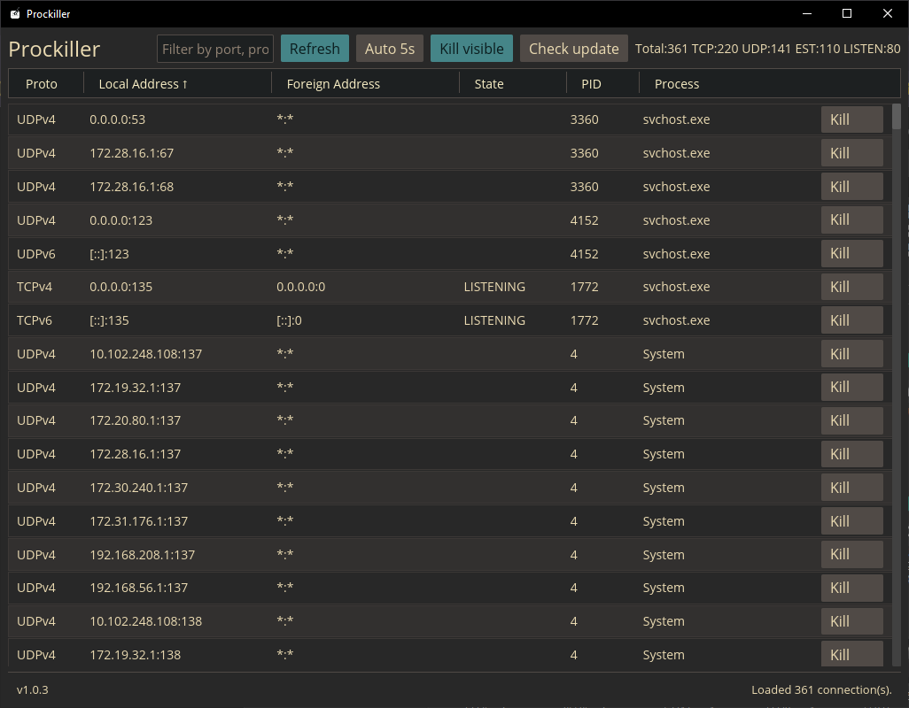

# Prockiller

A desktop app for Windows that lists active network connections and helps you
terminate the process behind a selected port after an explicit confirmation. Built with Rust and
[iced](https://iced.rs).



## Features

- **Live connection table** — protocol, local address, foreign address, state, PID,
  and process name for every active connection (backed by `netstat` / `tasklist`).
- **Port-first workflow** — enter a local port directly, then jump back to recent
  ports without retyping them.
- **Safe termination** — row-level and visible-process kills open a confirmation
  panel before Prockiller runs `taskkill /F`.
- **Quick filters** — narrow to listening, established, TCP, UDP, or local
  bindings before killing anything.
- **Search** — narrow the list by process, PID, address, protocol, or state as
  you type.
- **Sortable, resizable columns** — click a header to sort; drag the dividers to
  resize.
- **Auto-refresh** — the table updates every 5 seconds (toggleable).
- **Update check** — notifies you when a newer release is available.

## Download

Grab the latest `prockiller-iced-vX.Y.Z-windows-x64.exe` from the
[Releases](https://github.com/walterlow/prockiller/releases) page. It's a single
executable — no install required.

## Build from source

Install Rust:

```powershell
winget install Rustlang.Rustup
```

Then build:

```powershell
cargo build --release
```

Output: `target/release/prockiller-iced.exe`

Or use the helper script, which builds and stages a versioned, checksummed
artifact in `dist/` (mirrors the release pipeline):

```powershell
.\build-release.ps1
```

## Releases (CI/CD)

Releases are built by GitHub Actions ([`.github/workflows/release.yml`](.github/workflows/release.yml)).

To cut a release:

1. Bump `version` in `Cargo.toml`.
2. Commit, then tag and push:

   ```powershell
   git tag v1.0.6
   git push origin v1.0.6
   ```

The workflow first verifies the pushed tag matches the `version` in `Cargo.toml`,
then builds the release binary on `windows-latest`, names it
`prockiller-iced-v<version>-windows-x64.exe`, generates a matching `.sha256`
checksum, and attaches both to a GitHub Release with auto-generated notes. You can
also trigger it manually from the Actions tab (build-only, no release published).

Every push to `main` and every pull request runs [`.github/workflows/ci.yml`](.github/workflows/ci.yml),
which checks formatting, runs Clippy, builds, and runs the test suite.

## License

MIT
